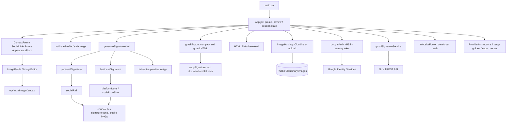

# Architecture and component inventory

## Runtime architecture

React/Vite runs entirely in the browser. Profile state, per-mode drafts, uploaded-image crop state, OAuth tokens and upload caches are in memory. There is no application database, server session or persistent draft storage.



## Active components

| Component | Responsibility |
| --- | --- |
| main.jsx | Mounts React App |
| App.jsx | Owns profile/drafts, tabs, preview, review, exports and OAuth lifecycle |
| ContactForm | Contact fields and validation messages; optional business name |
| SocialLinksForm | Complete platform dropdown, URLs, visibility, add/remove rows |
| AppearanceForm | Colors, contact-strip color, layout and IconColorControl |
| ImageFields / ImageEditor | Mode-specific image upload, crop and size controls |
| IconColorControl | Original/palette/automatic-contrast icon options |
| WebsiteFooter | Website-only developer credit linked to Zimi Lingani’s GitHub; never included in signature exports |
| ProviderInstructions | Gmail, Outlook, Apple Mail and all copy-method instructions |
| GmailExportNotice | HTML budget/upload status and explicit image-free fallback |
| ImageHostingSetup | Owner guidance when upload hosting is missing |
| GoogleSetupGuide | Owner instructions for OAuth setup |

SignaturePreview.jsx, CopyButton.jsx and GmailInstallButton.jsx are legacy components not imported by the current App; the live App renders equivalent controls inline. They must not be mistaken for active runtime entry points.

## Modules and boundaries

- generateSignatureHtml escapes text and validates images/colors; routes by mode.
- personalSignature renders the portrait, adaptive social rail and details.
- businessSignature renders the logo, identity, adaptive top-right platform rows and no-wrap contact strip.
- socialRail defines platform-to-icon mapping and adaptive sizing. No platform-count cap; display groups keep icons legible.
- signatureIcons resolves stable public URLs. iconPalette resolves palette/contrast variants.
- optimizeImage converts browser canvas output into compact JPEG/PNG, aiming at at most 96 KiB.
- imageHosting validates output, uploads generic file names and returns verified HTTPS URLs; caches successful uploads in memory.
- gmailExport compacts markup and applies an 8,000-character conservative app guard; it is not a guarantee about Gmail counting.
- copySignature writes text/html and text/plain; permission failure attempts a formatted legacy clipboard path.
- googleAuth wraps GIS token consent, expiry and revocation.
- gmailSignatureService lists send-as identities and updates only the primary signature.
- sanitizeSignatureHtml is a legacy regex helper, not a comprehensive sanitizer and not a security boundary. Arbitrary user HTML is not an input to the generator.

## Repository map

```text
src/
  components/  forms, setup instructions, export notices
  data/        default profile and icon palettes
  services/    image hosting, Google consent, Gmail REST calls
  utils/       HTML templates, validation, export/copy, image optimization
  styles/      app and preview styling
public/icons/  PNG icons and palette variants
scripts/       icon generation and Wiki publishing
tests/browser/ browser integration and geometry checks
docs/          permanent documentation and Mermaid diagrams
.github/workflows/ CI and main-only Pages deployment
```

## Rendering choices

Tables, inline styles and raster PNG icons maximize email compatibility. Browser previews are not guarantees of Outlook/Gmail rendering. Business contact fields deliberately expand horizontally rather than wrapping. Very long fields/platform lists can widen or heighten a signature and hit provider limits. No layout uses location information.

## Dependencies

Runtime: React, React DOM, Vite React plugin/build tooling. No Google SDK package: GIS is loaded from Google and Gmail uses fetch. Development: Vitest, Testing Library, Playwright, Sharp and ESLint. GitHub Actions installs from package-lock.json. Keep lockfile changes reviewed; package ranges currently include latest, so deliberate dependency upgrades require regression testing.
