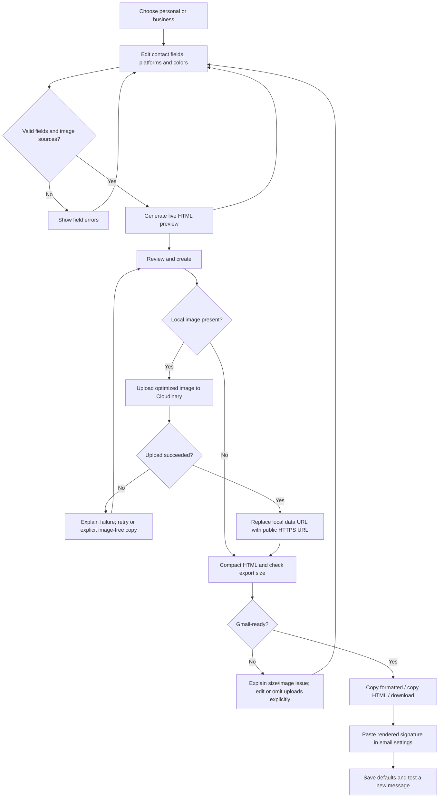
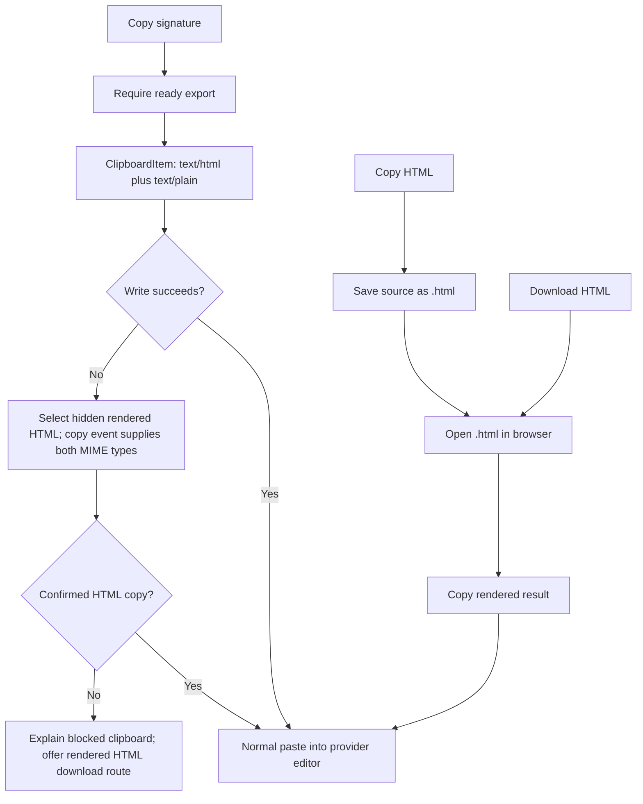
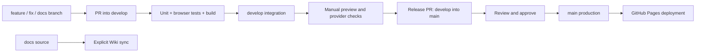

# Process diagrams

## Editing, upload, review and export



## Image lifecycle

```mermaid
sequenceDiagram
  participant User
  participant Editor as ImageEditor
  participant Canvas as Browser canvas
  participant App
  participant Host as Cloudinary
  User->>Editor: Select JPG / PNG / WebP
  Editor->>Editor: Check 5 MiB and 40 megapixel input limits
  Editor->>Canvas: Decode, crop personal photo, retain logo aspect ratio
  Canvas-->>App: Optimized JPEG / PNG data URL, at most 96 KiB
  User->>App: Review and create
  App->>Host: Unsigned preset upload (no API secret)
  alt Upload succeeds
    Host-->>App: Public HTTPS image URL
    App->>App: Ignore stale result if draft changed; otherwise update profile
  else Upload fails
    App-->>User: Retry/setup guidance; no silent image removal
  end
```

Browser-side upload limits can be bypassed; unsigned hosting requires quota monitoring and provider restrictions. Removing a photo from the editor does not delete its hosted asset.

## Clipboard paths



## Optional Gmail OAuth

```mermaid
sequenceDiagram
  participant User
  participant App
  participant GIS as Google Identity Services
  participant Gmail as Gmail REST API
  User->>App: Connect Google
  App->>GIS: Request gmail.settings.basic
  GIS->>User: Consent prompt
  alt Consent succeeds
    GIS-->>App: Short-lived token kept in memory
    User->>App: Install in Gmail
    App->>App: Validate token, hosted images and HTML budget
    App->>Gmail: GET users/me/settings/sendAs
    Gmail-->>App: Send-as identities
    App->>Gmail: PATCH primary identity (signature only)
    Gmail-->>App: Sanitized signature / result
    App-->>User: Success; verify new Gmail message
  else Canceled, denied or API error
    App-->>User: Error and manual-copy fallback
  end
  User->>App: Disconnect
  App->>GIS: Revoke token grant
```

No email-reading/sending/contact scopes are requested. No Google client secret or refresh token is stored. Live authorization still needs a configured Cloud project and test account.

## Release process



